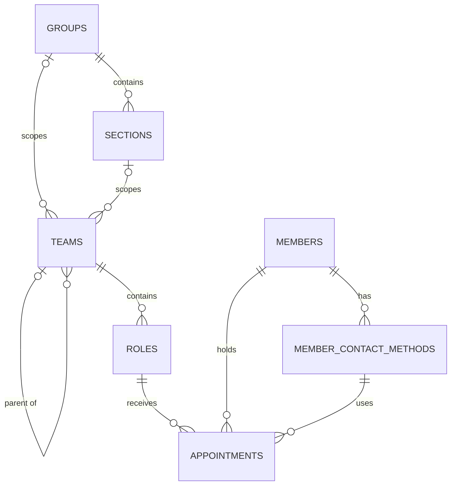

# Application data schema

This CakePHP application stores an organisational structure, its members, and the members appointed to roles. The schema is defined by the migrations in `config/Migrations/`; CakePHP table classes add application-level validation and lifecycle behavior.

The default database driver is PostgreSQL. All domain records use UUID primary keys. The schema does not define created or modified timestamp columns.

## Relationship overview

- Teams form a hierarchy through a self-referencing parent relationship.
- A team can define many roles; every role belongs to exactly one team.
- A member can have many contact methods.
- An appointment associates one member and one of their contact methods with a role for an effective date range.

## `teams`

Represents an organisational unit. CakePHP's Tree behavior maintains a nested-set representation alongside the direct parent reference.

| Column | Database type | Null | Default | Purpose |
| --- | --- | --- | --- | --- |
| `id` | `uuid` | No | — | Primary key. |
| `team_name` | `varchar(255)` | No | — | Human-readable team name. |
| `group_id` | `uuid` | No | — | Required group, including the district group. |
| `section_id` | `uuid` | Yes | `NULL` | Optional section within the selected group. |
| `team_parent_id` | `uuid` | Yes | `NULL` | Parent team; `NULL` identifies a root team. |
| `sort_order` | `integer` | No | `0` | Saved ordering among siblings; maintained by the reorder action. |
| `tree_left` | `integer` | Yes | `NULL` | Nested-set left boundary, maintained by Tree behavior. |
| `tree_right` | `integer` | Yes | `NULL` | Nested-set right boundary, maintained by Tree behavior. |
| `tree_level` | `integer` | Yes | `NULL` | Depth in the team hierarchy, maintained by Tree behavior. |
| `slug` | `varchar(255)` | Yes | `NULL` | URL-safe value generated by the entity when `team_name` is assigned. |

Constraints and indexes:

- Primary key: `id`.
- Foreign key: `team_parent_id → teams.id`, with `ON UPDATE CASCADE` and `ON DELETE RESTRICT`.
- Index: `tree_left`.
- Reordering updates `sort_order` and rebuilds tree coordinates atomically, preserving parents and moving each subtree together. New or reparented teams append to their siblings. Child-team associations use `sort_order`, with UUID as a stable tiebreaker.
- The ORM verifies that a supplied parent exists.
- The `TeamLead` has-one association selects the team's role where `is_lead` is true. Loading `SubTeams.TeamLead` exposes each child team's lead role to its parent.

Team scope is independent of the parent-team hierarchy. A district or group
leadership team has a group and no section; a section leadership team has both.
Every team requires a group; sections remain optional. The ORM requires a selected section to belong to
the selected group. The database enforces `group_id → groups.id` and the composite
`(section_id, group_id) → sections.(id, group_id)`, with update cascades and delete
restrictions. A section moving groups therefore updates its linked teams' group
IDs. `teams.group_id` is NOT NULL.

## `groups` and `sections`

These models mirror DistrictBadges' core data fields, without its account/order
relationships. Both use shared core data UUID primary keys.

| Model | Fields |
| --- | --- |
| Group | `id`, `group_name` (required, unique, max 255), `group_osm_id` (nullable integer), `sort_order` (nullable integer), `type` (nullable string, max 16), `domains` (nullable JSON hostname list), `sections_count`, `teams_count`, `roles_count` (non-null integer counter caches) |
| Section | `id`, `group_id` (required FK), `section_osm_id` (required unique positive integer), `section_name` (required unique, max 255), `section_type` (required, max 32), `meeting_start_time`, `meeting_end_time` (nullable `HH:MM` strings), `meeting_day` (nullable weekday name) |

`groups.type` is hydrated as `App\Model\Enum\GroupType`, a string-backed enum
with `Group = 'group'` and `District = 'district'`. JSON exposes its lowercase
backing value. `domains` hydrates to a list of hostname strings. Both fields are
required for new imports; domain lists must be non-empty and contain hostnames,
not URLs. Existing groups remain null until synced, so no classification is
inferred during migration. The teams API includes only teams linked to groups
classified as `District`. A non-unique index on `groups.type` supports filtering.
The counters are backfilled by migration. CakePHP's `CounterCache` behavior
maintains section and team counts. The role count is recalculated when a role or
its owning team is saved, moved, or deleted because roles reach groups through
teams rather than a direct association.

Section types match DistrictBadges: `earlyyears`, `beavers`, `cubs`, `scouts`,
`explorers`. A group has many sections and teams; a section belongs to one group
and has many teams. `sections.group_id → groups.id` restricts deletion and cascades
updates. `(sections.id, sections.group_id)` has a unique index for team references.
The core data importer upserts both models by UUID in one transaction and keeps
records absent from a feed. It does not create teams.

## `roles`

Represents a position within a team.

| Column | Database type | Null | Default | Purpose |
| --- | --- | --- | --- | --- |
| `id` | `uuid` | No | — | Primary key. |
| `team_id` | `uuid` | No | — | Team that owns the role. |
| `name` | `varchar(255)` | No | — | Role name. |
| `slug` | `varchar(255)` | No | — | URL-safe value generated by the entity when `name` is assigned. |
| `description` | `varchar(255)` | Yes | `NULL` | Optional short description. |
| `currently_filled` | `boolean` | No | `false` | Cached indication that the role has a current active appointment. |
| `is_lead` | `boolean` | No | `false` | Identifies the team's designated lead role. |

Constraints and behavior:

- Primary key: `id`.
- Foreign key: `team_id → teams.id`, with `ON UPDATE CASCADE` and `ON DELETE CASCADE`.
- After an appointment is saved or deleted through the ORM, `currently_filled` is recalculated. It is true when at least one appointment is active, has started, and has no end date or an end date on or after today.
- A model rule requires `slug` to be unique across both roles and teams. This is application-enforced and is not backed by a database uniqueness constraint.
- A partial unique index on `team_id` where `is_lead = true`, backed by a model rule, allows at most one lead role per team.

## `members`

Stores the people who can hold roles.

| Column | Database type | Null | Default | Purpose |
| --- | --- | --- | --- | --- |
| `id` | `uuid` | No | — | Primary key. |
| `first_name` | `varchar(100)` | No | — | Given name. |
| `last_name` | `varchar(100)` | No | — | Family name. |
| `membership_number` | `integer` | No | — | Unique external or organisational membership number. |
| `join_date` | `date` | No | — | Date membership began. |
| `leave_date` | `date` | Yes | `NULL` | Date membership ended. |
| `active` | `boolean` | No | `true` | Cached membership status. |

Constraints and behavior:

- Primary key: `id`.
- Unique index: `membership_number`.
- Before an ORM save, `active` is set to `true` exactly when `leave_date` is `NULL`; callers cannot independently choose the stored status.
- The entity exposes `full_name` as a virtual, non-database field formed from `first_name` and `last_name`.

## `member_contact_methods`

Stores a member's email addresses, email aliases or groups, and phone numbers.

| Column | Database type | Null | Default | Purpose |
| --- | --- | --- | --- | --- |
| `id` | `uuid` | No | — | Primary key. |
| `member_id` | `uuid` | No | — | Member who owns the contact method. |
| `contact_method` | `varchar(255)` | No | — | Address, group, alias, or phone number. |
| `contact_method_type` | `integer` | No | `1` | Enum discriminator described below. |
| `is_non_group_email` | `boolean` | No | `false` | Whether an email contact method's domain is absent from every group's configured domains. Calculated on save. |

`contact_method_type` values:

| Value | Application enum | Meaning |
| ---: | --- | --- |
| `1` | `Email` | Email address. |
| `2` | `EmailAlias` | Email alias. |
| `3` | `EmailGroup` | Group email address. |
| `10` | `PhoneNumber` | Telephone number. |

Constraints:

- Primary key: `id`.
- Foreign key: `member_id → members.id`, with `ON UPDATE CASCADE` and `ON DELETE CASCADE`.
- Unique index: (`contact_method`, `member_id`), preventing the same contact value from being stored twice for one member. The value may be reused by different members.
- Enum membership is enforced by CakePHP validation, not by a database check constraint.

## `appointments`

Records a member's appointment to a role, including the contact method to use for that appointment.

| Column | Database type | Null | Default | Purpose |
| --- | --- | --- | --- | --- |
| `id` | `uuid` | No | — | Primary key. |
| `role_id` | `uuid` | No | — | Role being filled. |
| `member_id` | `uuid` | No | — | Appointed member. |
| `member_contact_method_id` | `uuid` | No | — | Contact method associated with the appointment. |
| `effective_start_date` | `date` | No | — | First effective day. |
| `effective_end_date` | `date` | Yes | `NULL` | Last effective day; `NULL` means open-ended. |
| `active` | `boolean` | No | `true` | Whether the appointment participates in current-role occupancy. |

Constraints:

- Primary key: `id`.
- Foreign key: `role_id → roles.id`, with `ON UPDATE CASCADE` and `ON DELETE CASCADE`.
- Foreign key: `member_id → members.id`, with `ON UPDATE CASCADE` and `ON DELETE CASCADE`.
- Foreign key: `member_contact_method_id → member_contact_methods.id`, with `ON UPDATE CASCADE` and `ON DELETE CASCADE`.
- Unique index: (`role_id`, `member_id`, `effective_start_date`). This permits multiple members in a role, and repeat appointments of the same member, provided their start dates differ.

## Integrity boundaries and caveats

The following rules are important when writing data outside the CakePHP ORM:

- The database guarantees that an appointment's member and contact method both exist, but does **not** guarantee that the selected contact method belongs to that same member.
- There is no database or application validation requiring `effective_end_date >= effective_start_date`.
- There is no database or application validation requiring `leave_date >= join_date`.
- `roles.currently_filled`, `members.active`, team tree coordinates, and generated slugs rely on ORM callbacks or behavior. Direct SQL writes can leave these derived values stale or inconsistent.
- Cascading deletion of a team removes its roles and their appointments. Deleting a member removes their contact methods and appointments. Deleting a contact method also removes appointments that reference it.
- A team with child teams cannot be deleted until its children are moved or removed because the self-reference uses `ON DELETE RESTRICT`.

## Source of truth

- Database structure: `config/Migrations/`
- Associations, validation, and callbacks: `src/Model/Table/`
- Enum values: `src/Model/Enum/ContactMethodType.php`
- Generated fields and entity behavior: `src/Model/Entity/`

When this document and the implementation differ, the migrations and model code are authoritative.
